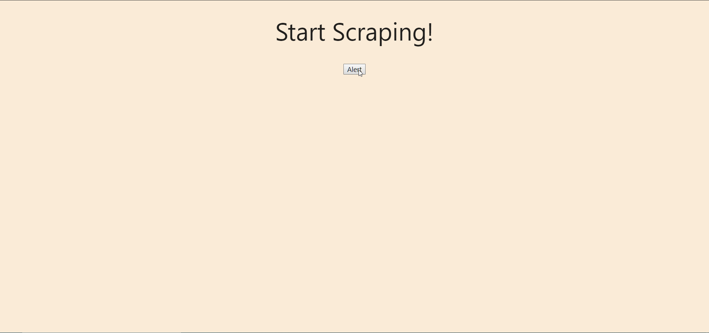

# Scraping-Up-News

Welcome to Scraping-Up-News! 
You may click "Scrape Now" to start scraping the desired site (default echojs.com). Once scraped, it will redirect you to all the articles it received! 

The articles can hold individual notes, sectioned off per article, and can delete the notes as well. Articles can also be saved and unsaved.

----

## Getting Started

* All files are necessary to be downloaded in order for the program to work. 

* You must install dependencies before running server.

The program also uses a NoSQL Database:
* Heroku: mLab Mongo Database

* Offline: MongoDB 

----

### Prerequisites 

* You must install NodeJS for the server to run.

* The app uses Express to host the webpage (Set to process.env.PORT, or default 3000).

* You must install MongoDB locally and the app will automatically create the database "mongoHeadlines".

  Once these are installed, your app is ready to be initialized.

----

### Installing & Deployment

You must install all dependencies through Node's package manager. The package.json file is provided to you for easy installation, run the command: `npm i`

Once all dependencies are installed, your app is ready to be launched! To launch, run: `node server.js`

## Built With

* JQuery
* NoSQL (Mongo DB/ mLab Mongo DB)
* Mongoose
* Express
* Handlebars

## Authors

* **Esar Behlum** 
